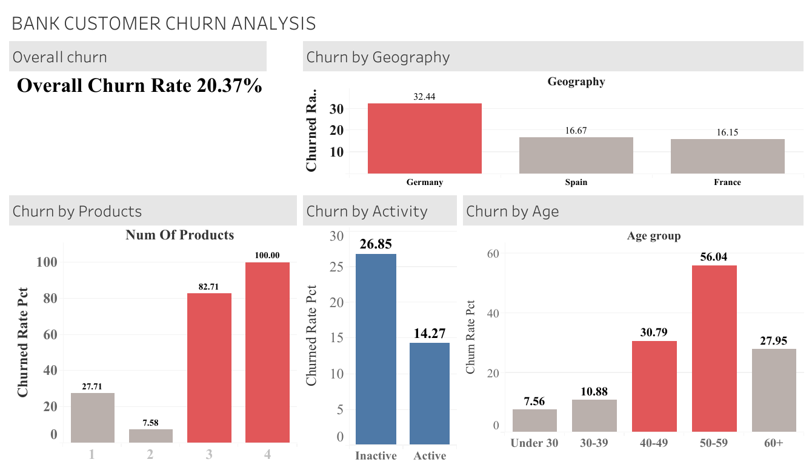

# Bank Customer Churn Analysis

## Overview
This project looks at why customers leave a retail bank, using a dataset of 10,000 customers. I wanted to find out which customers are most likely to churn, and why ?.The kind of question a bank's retention team would actually care about.

This was my first full data analytics project, built to apply what I learned in the Google Data Analytics Certificate on real data, from raw numbers to a published dashboard.

## Tools Used
- **SQL (Google BigQuery)** — analyzing the data
- **Tableau Public** — building the dashboard
- **Excel** — cleaning the data

## What I Did
1. Loaded a 10,000-customer bank dataset into BigQuery
2. Used SQL to check churn by country, number of products, account activity, and age
3. Built an interactive dashboard in Tableau to show the findings
4. Published it online for anyone to view

## Key Findings

**1. Germany churns almost twice as much as France or Spain.**
32.4% of German customers left, compared to about 16% in France and Spain.

**2. Holding 3 or more products is a major red flag.**
Churn jumps from 7.6% (2 products) to 82.7% (3 products) and 100% (4 products) — and this pattern shows up in every country, not just Germany.

**3. Inactive customers leave twice as often as active ones.**
26.9% of inactive customers churned, compared to 14.3% of active ones.

**4. Older customers churn more — and it's worse in Germany.**
Churn rises steadily with age, peaking at 56% for customers aged 50–59. In Germany specifically, that same age group churns even higher, at 77.7%. This suggests Germany's overall higher churn isn't random — it's partly driven by older customers there leaving at a much higher rate than older customers elsewhere.

## Retention Recommendations

**1. Prioritize Germany.**
Launch a dedicated retention campaign for German customers — localized offers, relationship-manager outreach, or a review of local competitors — since this market has the highest churn.

**2. Review customers with 3+ products.**
When a customer reaches 3 products, check in with them. Confirm the products still make sense, simplify their holdings if needed, or offer better bundles.

**3. Win back inactive customers.**
Build a re-engagement program — personalized offers, account check-ins, or app nudges — to bring inactive customers back before they leave for good.

**4. Flag high-risk customers.**
Customers who are German, inactive, and hold 3+ products at once are the highest risk. A short list like this makes it easy to prioritize outreach where it matters most.

**5. Test it first.**
Run a small pilot on one high-risk group (e.g., inactive German customers in their 50s), measure the impact over 30-60 days, then scale what works.

## Dashboard
🔗 **[View the live interactive dashboard](https://public.tableau.com/views/BANKCUSTOMERCHURNANALYSIS_17866670959890/Dashboard1?:language=en-US&publish=yes&:sid=&:redirect=auth&:display_count=n&:origin=viz_share_link)**

## What I'd Explore Next
- What's actually driving the 3+ product churn spike — CRM notes or survey data would help explain the "why"
- Whether the German age problem relates to a specific life stage need, like retirement banking
- A time-series view to see if these patterns are getting better or worse over time

## Files in This Repo
- `queries.sql` — all SQL queries used
- `dashboard-preview.png` — screenshot of the dashboard
- `README.md` — this file
